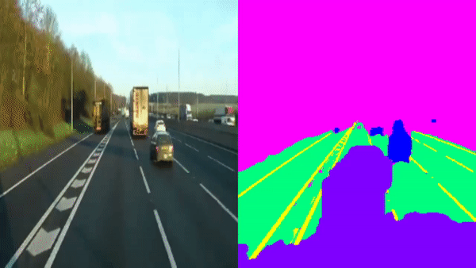

# UNet segmentation for self driving car
Wanted to impliment a Unet form scratch and self driving cars are cool so lets 
use a UNet on Comma.ai's 10k image segmentation data set.

  

Needs some more training this is after 10 Ephochs

## Steps to train your own model.

### Step One
Clone this repository

### Step Two
In the main Directory of this repository clone the Commaai 10k repository

### Step Three
Install dependencies from requirements.txt

### Step Four
Need to do some preprocessing on the Masks to make training faster. The masks
are currently saved as RGB images that are nice for Hoomans to read. Run make_cat_masks.py

### Step Five
Run train.py - This will train the model on the data and give a show you the progress of
the mask.

## TODO
- ~~Make training image show in colour not gray scale~~
- ~~Add Infrence and save Model functionality~~
- Train longer
- Try on a drive
